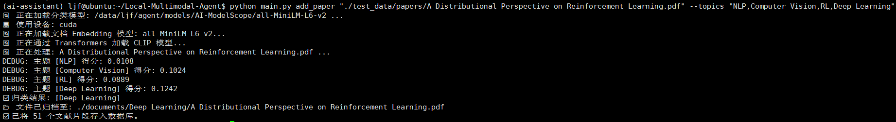
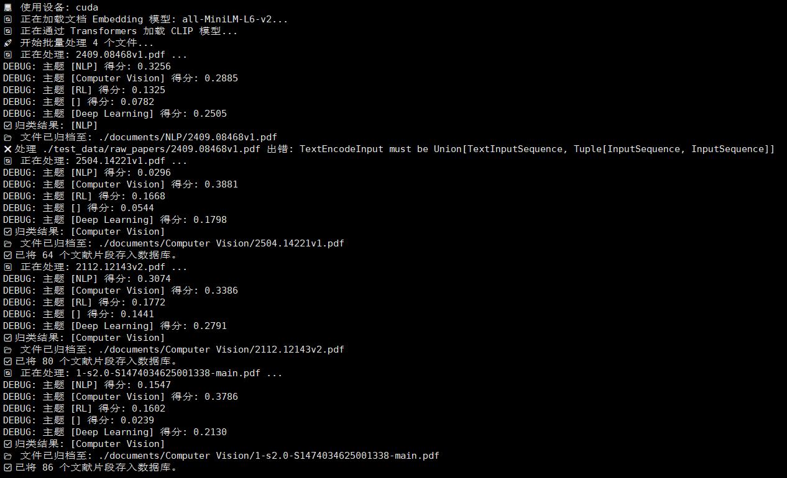
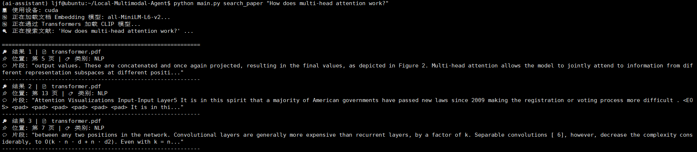
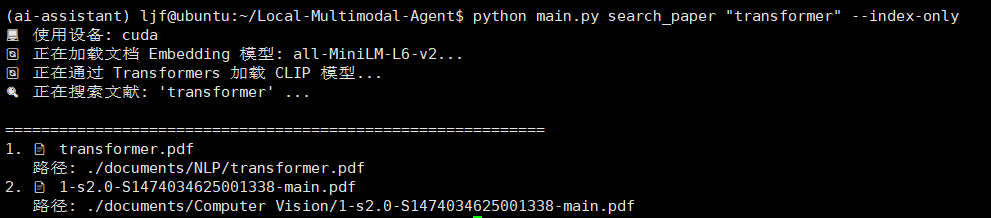
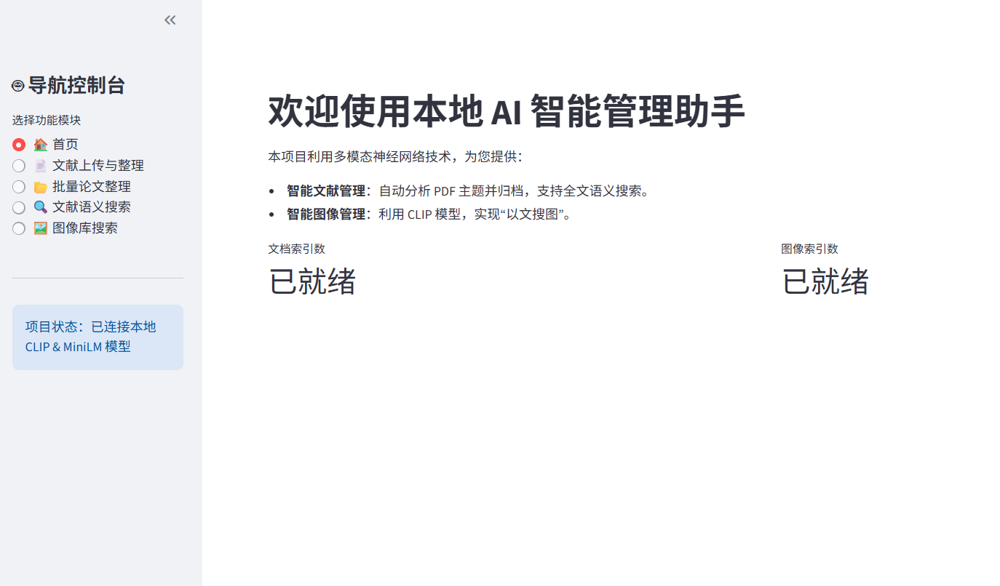
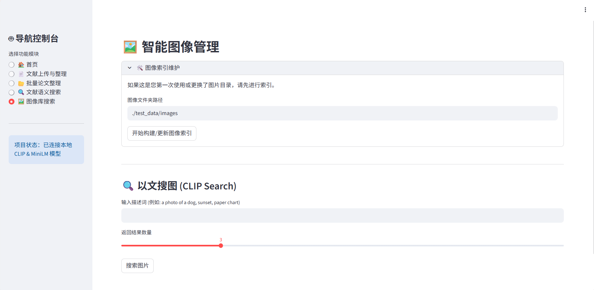

# Local Multi-modal AI Agent: 智能文献与图像管理助手

本项目是一个基于多模态 Embedding 技术的本地 AI 知识管理系统。它能够自动识别、归类学术论文，并利用 CLIP 模型实现跨模态的“以文搜图”功能，同时提供美观的 Streamlit 交互界面。

## 🌟 项目背景

在数字化科研时代，管理海量的 PDF 文献和图像资料是一项挑战。传统搜索依赖于关键词匹配，难以理解文档背后的深层语义。本项目通过以下核心能力解决这一痛点：

1. **自动化整理**：利用语义向量模型，实现论文的自动主题分类与文件归档。
2. **深层检索**：支持跨文件、跨页码的全文语义搜索。
3. **多模态搜索**：引入 OpenAI 的 CLIP 模型，打破文本与图像的界限，实现自然语言搜索本地图片。

---

## 🛠️ 技术栈与工具

* **核心框架**: `Python 3.10+`
* **向量数据库**: `ChromaDB` (用于高效存储和检索高维向量)
* **文档处理**: `LangChain`, `PyPDFLoader`, `RecursiveCharacterTextSplitter`
* **文本嵌入 (NLP)**: `Sentence-Transformers` (模型: `all-MiniLM-L6-v2`)
* **多模态嵌入 (CV/NLP)**: `HuggingFace Transformers` (模型: `OpenAI CLIP ViT-B-32`)
* **前端界面**: `Streamlit`
* **文件操作**: `Python OS/Shutil` (实现物理归档)

---

## 📂 项目文件结构
运行时注意检查模型路径问题
```text
Local-Multimodal-Agent/
├── main.py                # 命令行交互入口
├── app.py                 # Streamlit Web 交互界面
├── modules/
│   ├── config.py          # 路径与模型常量配置
│   ├── vector_store.py    # ChromaDB 管理 (支持双 Collection)
│   ├── classifier.py      # 语义分类逻辑 (支持 Prompt 增强)
│   └── doc_processor.py   # PDF 加载与物理归档逻辑
├── models/                # 本地存放下载好的模型权重
│   ├── AI-ModelScope/     # all-MiniLM 模型
│   └── openai/            # CLIP 权重 (snapshots 目录)
├── test_data/             # 测试数据目录
│   ├── papers/            # 原始测试 PDF
│   └── images/            # 用于索引的图片库
└── db/                    # ChromaDB 持久化数据
└── documents/             # 归档后的PDF文件

```

---

## 🚀 核心功能与运行命令

### 环境配置

```bash
pip install -r requirements.txt
```

### 模型下载(CLIP ViT-B-32 与 all-MiniLM-L6-v2)

```bash
python download_model2.py
```

### 1. 论文处理与自动归类

输入一个 PDF 路径和可选的主题列表，系统会自动分析摘要，将文件物理移动到对应的主题文件夹中，并建立全文索引。

```bash
python main.py add_paper "./test_data/papers/A Distributional Perspective on Reinforcement Learning.pdf" --topics "NLP,Computer Vision,RL,Deep Learning"
```
示例运行结果：

### 2. 批量处理文件夹

自动扫描指定目录下的所有 PDF 文件进行迭代分类，实现一次性处理整个文件夹。

```bash
python main.py batch_process "./test_data/raw_papers" --topics "NLP,Computer Vision,RL,,Deep Learning"
```
示例运行结果：

### 3. 文献语义搜索

支持返回具体的匹配片段及其所在的 PDF 页码。

```bash
# 模式 A: 详细片段搜索
python main.py search_paper "How does multi-head attention work?"

# 模式 B: 仅返回相关文件列表
python main.py search_paper "transformer" --index-only

```
示例运行结果：

（1）. 详细片段搜索

（2）. 仅返回相关文件列表

### 4. 图像库索引与以文搜图

利用 CLIP 将本地图片库向量化，随后可通过自然语言进行检索。

**注：目前仅支持先对图片进行索引之后再实现以文搜图功能，可使用可视化控制台自动进行索引**

```bash
# 建立图片索引
python main.py index_images "./test_data/images"

# 跨模态搜索图片
python main.py search_image "a sunset at the beach"

```
示例运行结果：

### 5. Streamlit 可视化控制台

启动美观的 Web 后台，享受一键式上传、进度条显示及图片并排展示体验。

```bash
streamlit run ui.py

```


---

## 💡 技术亮点：语义分类优化 (Classifier Optimization)

1. 项目在分类逻辑中加入了 **Prompt Engineering**。例如，用户输入主题 `NLP`，系统会自动扩展为 `Natural Language Processing, text, translation, BERT...`，从而显著提升小参数模型（MiniLM）的分类准确率，并有效过滤 PDF 第一页的作者及机构噪音。

2. 在使用CLIP进行图文匹配时，采用了Prompt Template来提升检索精度。使用 "a photo of a..." 能让 Query 向量在特征空间中定位到更精准的区域

---
